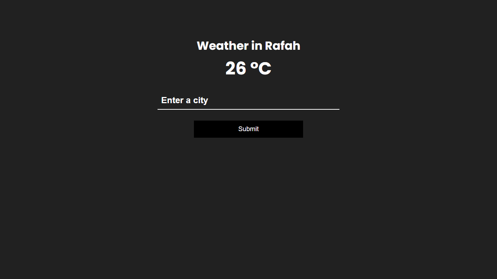

# API Proxy Server

Server used for hiding API keys, rate limiting and caching.

This uses the [OpenWeather API](https://openweathermap.org/api) (Check out the weather app in the public folder) but you can easily change it to whatever public API you are using

## Demo



The public key is hidden from the client in `public/main.js`

```js
// Fetch weather data from API
const fetchWeather = async city => {
  const url = `/api?q=${city}`;

  const res = await fetch(url);
  const data = await res.json();

  if (data.cod === '404') {
    alert('City not found');
    return;
  }

  if (data.cod === 401) {
    alert('Invalid API Key');
    return;
  }

  const displayData = {
    city: data.name,
    temp: kelvinToCelcius(data.main.temp),
  };

  addWeatherToDOM(displayData);
};
```

## Usage

1- Clone/Download the repository

2- Install dependencies

```
$ npm i
```

3- Rename **.env.example** to **.env** and edit the values

In this weather app, the public API URL is **https://api.openweathermap.org/data/2.5/weather?q={city}&appid={APIkey}**

then the **.env** values in this example will be:

- PORT=5000
- API_BASE_URL=https://api.openweathermap.org/data/2.5/weather
- API_KEY_NAME=appid
- API_KEY_VALUE=YOUR_API_KEY

4- Run the server on `https://localhost:PORT` (Default port value is 5000)

```
$ npm run dev
```

## Notes

- You can add on any other query params as needed when hitting the /api endpoint such as https://yourdomain/api?q=detroit without having to add your key in the client

- Add new routes as you see fit

- Change rate limiting and caching to desired values

_Enjoy 🤗_
